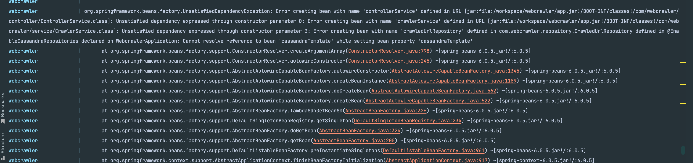

## Web Crawler Application
This application is used to crawl urls from a given website url.
It crawls only urls related to the same domain of the root url. i.e https://www.monzo.com would only visit urls in that domain.
It has a configuration for the maximum request it can make to a website during the crawl process.

### High level design


### Built with
* [Springboot](https://spring.io/)
* [Maven](https://maven.apache.org/)
* [Redis cache](https://redis.io/)
* [Cassandra DB](https://cassandra.apache.org/)
* [JDK 17](https://bell-sw.com/pages/downloads/)

## Getting started

### Starting up project

First, Unzip the project.

#### Starting up the project using Docker

### Prerequisites

**Docker** - This project runs on docker, makes setup faster and you don't have to download individual components on your system [Download docker for your desktop here](https://www.docker.com/products/docker-desktop/).<br/>
If using homebrew on Mac, You can also install docker using ```brew install docker```

After Installing docker, 
- start up the docker desktop
- with your terminal tool, navigate to the project folder (in this case ```webcrawler```) and run the ```docker compose up``` command

This will download all the necessary dependencies within docker and start up the project. the [application.properties](src%2Fmain%2Fresources%2Fapplication.properties) I have already pre-configured the project with the docker details so it's easy to start up with docker
You can then access the project on  [http://localhost:8080/](http://localhost:8080/)

NOTE: While starting up the project with docker, you will see errors like in the picture below, this is because cassandra DB is still starting up even though we specified that web crawler depends on cassandra to start up,
Please wait for some time until cassandra is done starting up. You do not have to do anything, the webcrawler container restarts automatically after cassandra is up


#### Starting up the project manually

### Prerequisites

To set up the project We'll need the following; If you are using homebrew on macbook you can also install these components using homebrew

**IDE** - Best to use a Java IDE like IntelliJ [download intelliJ here](https://www.jetbrains.com/idea/download/) or Eclipse [download Eclipse here](https://www.eclipse.org/downloads/) or with homebrew ```brew install --cask intellij-idea```

**JDK 17** - This project runs on JDK 17 which can be downloaded from here [JDK 17](https://bell-sw.com/pages/downloads/) or with homebrew ```brew install openjdk@17```

**Maven** - This project is a maven project and requires maven, some IDEs come with maven, but if you need to install it, you can get it [here](https://maven.apache.org/) and Install using [Maven Installation guide](https://maven.apache.org/install.html) 


This project depends on Redis(Cache) [Redis download and installation instructions can be found here](https://redis.io/download/#redis-downloads) and Cassandra(DB) [Cassandra DB download and installation instructions can be found here](https://cassandra.apache.org/_/download.html)
After installing these components, start them up and configure their respective details in the [application.properties](src%2Fmain%2Fresources%2Fapplication.properties) file.


Cassandra - ```brew install cassandra```

redis - ```brew install redis```

Maven - ```brew install maven```

After adding the configurations, run the [WebcrawlerApplication.java](src%2Fmain%2Fjava%2Fcom%2Fwebcrawler%2FWebcrawlerApplication.java) class, it will start up as it is a spring boot project.
You can then access the project on  [http://localhost:8080/](http://localhost:8080/)

### API Documentation and Usage
This project uses swagger UI for API documentation. 
You can access the project's swagger UI on [http://localhost:8080/webcrawler-api-doc.html](http://localhost:8080/webcrawler-api-doc.html) 
with the swagger UI you will be able to see the available endpoints and how to use them.
you will also be able to send request with the swagger UI by clicking on the ```Try it out``` button.
or you can make a request with postman, you can [download postman here](https://www.postman.com/) if you need to.

#### In App Configs
```webcrawler-max-request``` is used to configure the max request that can be made to a particular domain. configure in the [application.properties](src%2Fmain%2Fresources%2Fapplication.properties)

## Running the tests

This project has unit tests and integration tests. you can manually run the tests from the individual test classes.

#### unit tests

[CoreWebCrawlerTest.java](src%2Ftest%2Fjava%2Fcom%2Fwebcrawler%2Funit%2FCoreWebCrawlerTest.java) <br/>
[UrlExtractorTest.java](src%2Ftest%2Fjava%2Fcom%2Fwebcrawler%2Funit%2FUrlExtractorTest.java)

#### integration tests
[DockerIntegrationTest.java](src%2Ftest%2Fjava%2Fcom%2Fwebcrawler%2Fintegration%2FDockerIntegrationTest.java) - runs with docker </br>
[LocalIntegrationTest.java](src%2Ftest%2Fjava%2Fcom%2Fwebcrawler%2Fintegration%2FDockerIntegrationTest.java) - runs locally without docker

The tests also runs while building the project using ```mvn clean package``` command. </br>
For a project that uses docker, I needed to test the behaviour on docker as well so, The [DockerIntegrationTest.java](src%2Ftest%2Fjava%2Fcom%2Fwebcrawler%2Fintegration%2FDockerIntegrationTest.java) needs docker to be up and running before it can run successfully and you can use the ```@EnabledIf``` annotation to disable it if you do not have docker.

If you do not have docker, the integration test runs on [LocalIntegrationTest.java](src%2Ftest%2Fjava%2Fcom%2Fwebcrawler%2Fintegration%2FLocalIntegrationTest.java) which has all of it's components functionalities mocked using Mockito
Also disable the docker integration test while running the project with docker because, Although it is possible to run docker inside docker, it might not be the best idea

### Building after making changes to the code
After making change to the code and you need to re-run with docker, please run ```docker compose build``` first before you run ```docker compose up``` this is to ensure that the project is rebuilt after the change.


