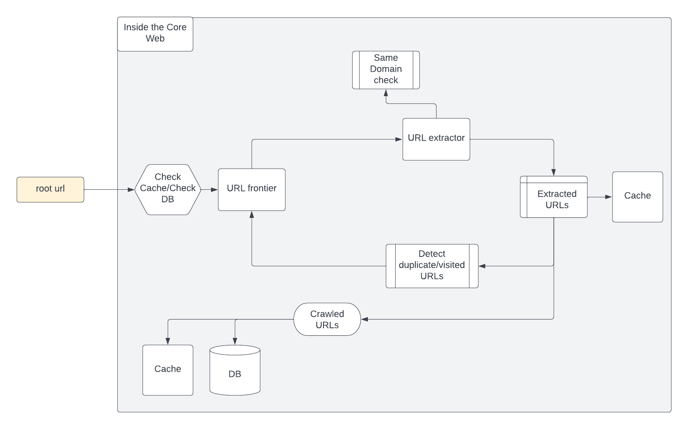

## Web Crawler Application
This application is used to crawl urls from a given website url.
It has a configuration for the maximum request it can make to a website during the crawl process.
It only crawls urls related to the same domain of the root url. i.e https://www.monzo.com would only visit urls in that domain.

### High level design


### Built with
* [Springboot](https://spring.io/)
* [Maven](https://maven.apache.org/)
* [Redis cache](https://redis.io/)
* [Cassandra DB](https://cassandra.apache.org/)

## Getting started

### Prerequisites

To set up the project We'll need the following;

**IDE** - Best to use a Java IDE like IntelliJ [download intelliJ here](https://www.jetbrains.com/idea/download/) or Eclipse [download Eclipse here](https://www.eclipse.org/downloads/)

**Maven** - This project is a maven project and requires maven, some IDEs come with maven, but if you need to install it, you can get it [here](https://maven.apache.org/) and Install using [Maven Installation guide](https://maven.apache.org/install.html)

**Docker** - This project runs on docker, makes setup faster and you don't have to download individual components on your system [Download docker for your desktop here](https://www.docker.com/products/docker-desktop/).

### Starting up project

#### Starting up the project using Docker
After Installing docker, 
- start up the docker desktop
- with your terminal tool, navigater to the project folder (in this case ```webcrawler```) and run the ```docker compose up``` command

This will download all the necessary dependencies within docker and start up the project. the [application.properties](src%2Fmain%2Fresources%2Fapplication.properties) I have already pre-configured the project with the docker details so it's easy to start up with docker
You can then access the project on  [http://localhost:8080/](http://localhost:8080/)

#### Starting up the project manually
This project depends on Redis(Cache) [Redis download and installation instructions can be found here](https://redis.io/download/#redis-downloads) and Cassandra(DB) [Cassandra DB download and installation instructions can be found here](https://cassandra.apache.org/_/download.html)
After installing these components, start them up and configure their respective details in the [application.properties](src%2Fmain%2Fresources%2Fapplication.properties) file.
If you are using hombrew on macbook you can also install these components using homebrew:

Cassandra - ```brew install cassandra```

redis - ```brew install redis```

Maven - ```brew install maven```

After adding the configurations, run the [WebcrawlerApplication.java](src%2Fmain%2Fjava%2Fcom%2Fwebcrawler%2FWebcrawlerApplication.java) class, it will start up as it is a spring boot project.
You can then access the project on  [http://localhost:8080/](http://localhost:8080/)

### API Documentation and Usage
This project uses swagger UI for API documentation. 
You can access the project's swagger UI on [http://localhost:8080/webcrawler-api-doc.html](http://localhost:8080/webcrawler-api-doc.html) 
with the swagger UI you will be able to see the available endpoints and how to use them.
you will also be able to send request with the swagger UI by clicking on the ```Try it out``` button.
or you can make a request with postman, you can [download postman here](https://www.postman.com/) if you need to.

## Running the tests

This project has unit tests and integration tests. you can manually run the tests from the individual test classes. The tests also runs while building the project using ```mvn clean package``` command
For a project that uses docker, I needed to test the behaviour on docker as well so, The [DockerIntegrationTest.java](src%2Ftest%2Fjava%2Fcom%2Fwebcrawler%2Fintegration%2FDockerIntegrationTest.java) needs docker to be up and running before it can run successfully, so you can use the ```@EnabledIf``` annotation to disable it.


